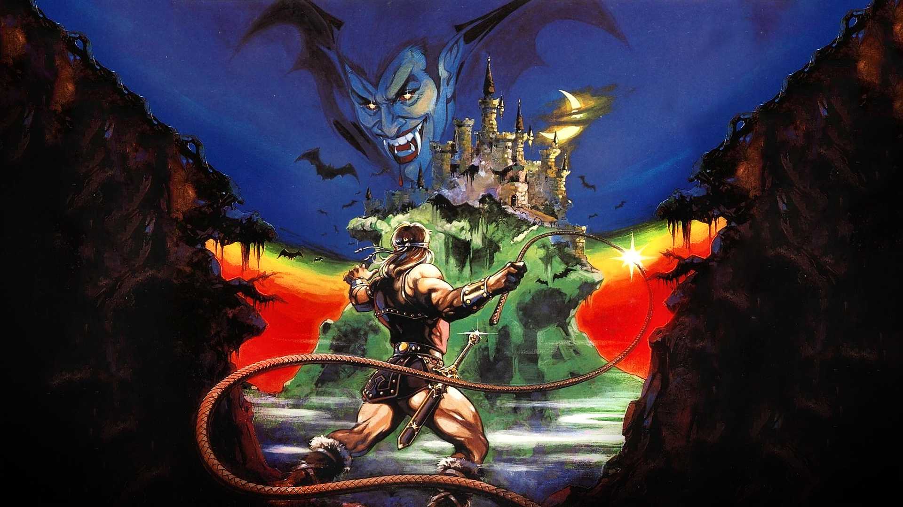

# 2024.2-Castlevania

<div align="center">  </div>
<div align="center">Repositório para desenvolvimento de um MUD inspirado em Castlevania da disciplina de SBD1 - 2024.2</div>

## 🤝 Contribuidores

<div align="center">

| Nome                                                                      | Matrícula |
| :------------------------------------------------------------------------ | :-------: |
| [Diego Carlito Rodrigues de Souza](https://github.com/DiegoCarlito)       | 221007690 |
| [Márcio Henrique de Sousa Costa](https://github.com/DeM4rcio)             | 221039497 |
| [Filipe Carvalho da Silva](https://github.com/Filipe-002)                 | 211030747 |
| [João Pedro Veras Gomes](https://github.com/JoosPerro)                    | 211061968 |
| [Emivalto da Costa Tavares Junior](https://github.com/EmivaltoJrr)        | 180100271 |

</div>

## 🎮 Jogo

Castlevania é um clássico jogo de ação e plataforma lançado em 1986 para o Nintendo Entertainment System (NES). O jogador assume o papel de Simon Belmont, um caçador de vampiros que pertence ao clã Belmont, cuja missão é derrotar o lendário Drácula. A história se passa no castelo de Drácula, que ressurge a cada 100 anos e espalha o terror pela Europa.

### Como o jogo funciona?

Simon Belmont deve atravessar o castelo cheio de monstros e criaturas sobrenaturais, derrotar Drácula e restaurar a paz. Ao longo do jogo, o jogador enfrenta inimigos clássicos do horror gótico, como zumbis, morcegos, medusas, e o próprio Drácula.

- **Exploração e Combate**: O jogo é dividido em seis estágios com chefes no final de cada fase. Simon utiliza seu principal equipamento, o chicote "Vampire Killer", para atacar inimigos.
- **Power-ups e Armas Secundárias**: Além do chicote, o jogador pode coletar armas secundárias como facas, machados e água benta, que consomem corações como "munição".

### Como rodar a documentação?

```bash
mkdocs serve
```

## 📎 Apresentações

<div align="center">

| Módulo | Link da gravação             | Data       |
| ------ | ---------------------------- | ---------- |
| 1      | [Apresentação Módulo 1](https://youtu.be/StAxu6V-pvs?si=bhTU_5ZB98D4P6_M)    | 25/11/2024 |
| 2      | [Apresentação Módulo 2]()    | Em andamento 🛠. |
| 3      | [Apresentação Módulo 3]()    | Em andamento 🛠. |

</div>

## 📁 Entregas

- Módulo 1

  - [Diagrama Entidade-Relacionamento](./docs/modulo1/der.md)
  - [Dicionário de Dados](./docs/modulo1/dd.md)
  - [Modelo Entidade-Relacionamento](./docs/modulo1/mer.md)
  - [Modelo Relacional](./docs/modulo1/mr.md)

- Módulo 2

  - [Normalização](./docs/modulo2/norm.md)
  - [DDL]()
  - [DML]()
  - [Álgebra Relacional]()
