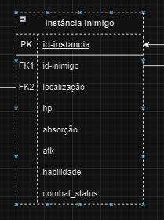
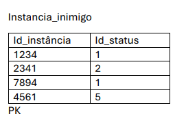
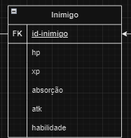

## Introdução

A normalização é um processo utilizado no design de bancos de dados para organizar os dados de forma eficiente, reduzindo redundâncias e melhorando a integridade dos dados. Por meio de uma série de regras e formas normais, a normalização divide as informações em tabelas menores relacionadas, promovendo consistência e facilitando o gerenciamento. Esse processo ajuda a evitar anomalias em operações como inserção, atualização e exclusão, além de otimizar o desempenho e a escalabilidade do sistema.

O processo de normalização se divide em 5 etapas, chamadas de Formas Normais (FN).

* **1ª Forma Normal (1FN)**: Na 1FN, cada campo da tabela deve conter apenas um único valor indivisível, e todos os registros da tabela devem ter a mesma estrutura, sem repetições de grupos de atributos.

* **2ª Forma Normal (2FN)**: Para estar em 2FN, é necessário que não haja dependências parciais, ou seja, todos os atributos não-chave devem depender da totalidade da chave primária.

* **3ª Forma Normal (3FN)**: Na 3FN, deve-se garantir que todos os atributos não-chave sejam diretamente dependentes da chave primária, sem intermediários.

* **Forma Normal de Boyce-Codd (FNBC)**: A FNBC é uma versão mais rigorosa da 3ª Forma Normal. Por já atender a 2ª e 3ª forma Normal.

* **4ª Forma Normal (4FN)**:  A 4FN exige que não existam dependências multivaloradas, onde um único atributo poderia ser relacionado a múltiplos valores de outro atributo de forma independente.

## Tabelas a serem Normalizadas

Todas as tabelas contidas na [primeira versão do MR](https://viewer.diagrams.net/?tags=%7B%7D&lightbox=1&highlight=0000ff&edit=_blank&layers=1&nav=1&title=MR-Castlevania.drawio#Uhttps%3A%2F%2Fdrive.google.com%2Fuc%3Fid%3D1iqkQ5bLyo5ngIUHikCxP1Zgu3P8RBQPV%26export%3Ddownload) ( modelo relacional), entraram no processo de normalização, sendo detalhadas a seguir.

---

## Tabela Sala

> id-sala➡ id_sala_conectada, id_regiao, nome e descr

Na tabela Sala, os atributos `id-sala` , ``id_sala_conectada``, ``id_regiao``, ``nome`` e `descr` atendem a esse critério, garantindo que ela esteja na 1ª Forma Normal.
 Como a tabela possui apenas uma chave primária simples (id-sala), automaticamente todos os atributos dependem da chave em sua totalidade.
Na tabela item, todos os atributos (``id_sala_conectada``, ``id_regiao``, ``nome`` e `descr`)  depende diretamente do `id-sala`, atendendo ao critério da 3ª Forma Normal.

 A tabela Sala, com atributos atômicos e monovalorados, não apresenta tais dependências, satisfazendo assim a 4ª Forma Normal.

---

## Tabela Bau

> id-bau➡ itens

Na tabela Bau, o atributo `itens` fere essa propriedade isso porque terá vários itens sendo um atributo multivalorado. Para que atende a esse critério, será necessário que o atributo `itens` sejá parte da chave primária, tornando `id-bau` e `itens` chave primária composta.

### Correção

tornando `itens` como chave primária e mudando seu nome para melhor clareza para `item` agora ele atende a **1ª Forma Normal**.

##

 Como a tabela possui apenas dois atributos das quais compõe a chave a primária (composta) não é ferido a 2ª Forma Normal.
Na tabela Bau todos os atributos são chaves.

 A tabela Bau, com atributos atômicos e monovalorados, não apresenta tais dependências, satisfazendo assim a 4ª Forma Normal.

---

## Tabela Baus

> id-bau, id-sala➡

Na tabela Baus, os atributos `id-sala` , ``id_bau`` atendem a esse critério, garantindo que ela esteja na 1ª Forma Normal.
 Como a tabela Baus possui apenas chave primária , automaticamente todos os atributos dependem da chave em sua totalidade.
Na tabela Baus, por não existir atributos não chave, automaticamente já é atendido a 3ª  Forma normal.

 A tabela Baus, com atributos atômicos e monovalorados, não apresenta tais dependências, satisfazendo assim a 4ª Forma Normal.

---

## Tabela Chefe

> id-Chefe ➡ localização, hp, level, status, atk, item_especial

Na tabela Chefe , os atributos `id-chefe` , ``localização``, `hp`, `level`, `status`, `atk` e `item_especial` atendem a esse critério, garantindo que ela esteja na 1ª Forma Normal.
 Como a tabela Chefe possui apenas uma chave primária , automaticamente todos os atributos dependem da chave em sua totalidade.
Na tabela item, todos os atributos (``localização``, ``hp``, ``level`` , `status`, `atk`, `item_especial`)  depende diretamente do `id-chefe`, atendendo ao critério da 3ª Forma Normal.

 A tabela Chefe, com atributos atômicos e monovalorados, não apresenta tais dependências, satisfazendo assim a 4ª Forma Normal.

---

## Tabela Checkpoint

> id-checkpoint ➡ id_sala, id_pc

Na tabela Checkpoint , os atributos `id-checkpoint` , ``id_sala``e `id_pc`, atendem a esse critério, garantindo que ela esteja na 1ª Forma Normal.
 Como a tabela Checkpoint possui apenas uma chave primária , automaticamente todos os atributos dependem da chave em sua totalidade.
Na tabela item, todos os atributos (``id_sala``e ``id_pc``)  depende diretamente do `id-checkpoint`, atendendo ao critério da 3ª Forma Normal.

 A tabela Checkpoint, com atributos atômicos e monovalorados, não apresenta tais dependências, satisfazendo assim a 4ª Forma Normal.

---

## Tabela Mundo

> id-mundo ➡ nome, data

Na tabela Mundo , os atributos `id-mundo` , ``nome``e `data`, atendem a esse critério, garantindo que ela esteja na 1ª Forma Normal.
 Como a tabela Mundo possui apenas uma chave primária , automaticamente todos os atributos dependem da chave em sua totalidade.
Na tabela item, todos os atributos (``nome``e ``id-data``)  depende diretamente do `id-mundo`, atendendo ao critério da 3ª Forma Normal.

 A tabela Mundo, com atributos atômicos e monovalorados, não apresenta tais dependências, satisfazendo assim a 4ª Forma Normal.

---

## Tabela Instância_Inimigo

Essa tabela trata-se de uma instância de um NPC denominado inimigo, que possuía os seguintes valores:

A tabela se encontra na 1ª FN, pois não existiam valores divididos e divisão de atributos. Porém, ao aplicar a 2ª FN, foi identificado que haviam atributos que não dependiam única e excluisivamente da chave primária id_instancia, sendo retirados e colocados em outra tabela. Mesma coisa com a 3ª FN. A tabela normalizada ficou assim:

---

## Tabela Inimigo

A tabela trata-se do perfil de um inimigo.

---

## Tabela PC

> id-pc ➡ hp, mp, xp, absorção, atk, lvl, luck, combat_status, coins, localização

Na tabela PC, os atributos `id-pc`, `hp`, `mp`, `xp`, `absorção`, `atk`, `lvl`, `luck`, `combat_status`, `coins` e `localização` atendem a esse critério, garantindo que ela esteja na 1ª Forma Normal.  
Como a tabela PC possui apenas uma chave primária, automaticamente todos os atributos dependem da chave em sua totalidade.  
Na tabela PC, todos os atributos (`hp`, `mp`, `xp`, `absorção`, `atk`, `lvl`, `luck`, `combat_status`, `coins`, `localização`) dependem diretamente do `id-pc`, atendendo ao critério da 3ª Forma Normal.  

A tabela PC, com atributos atômicos e monovalorados, não apresenta tais dependências, satisfazendo assim a 4ª Forma Normal.

---

## Tabela Transação

> id-transação ➡ id_mercador, id_pc, valor, tipo_transação

Na tabela **Transação**, os atributos `id-transação`, `id_mercador`, `id_pc`, `valor` e `tipo_transação` atendem a esse critério, garantindo que ela esteja na 1ª Forma Normal.  
Como a tabela **Transação** possui apenas uma chave primária, automaticamente todos os atributos dependem da chave em sua totalidade.  
Na tabela **Transação**, todos os atributos (`id_mercador`, `id_pc`, `valor`, `tipo_transação`) dependem diretamente do `id-transação`, atendendo ao critério da 3ª Forma Normal.  

A tabela **Transação**, com atributos atômicos e monovalorados, não apresenta tais dependências, satisfazendo assim a 4ª Forma Normal.

---

## Tabela Combate

> id-combate ➡ id_pc, id_inimigo, resultado  

Na tabela **Combate**, os atributos `id-combate`, `id_pc`, `id_inimigo` e `resultado` atendem a esse critério, garantindo que ela esteja na 1ª Forma Normal.  
Como a tabela **Combate** possui apenas uma chave primária, automaticamente todos os atributos dependem da chave em sua totalidade.  
Na tabela **Combate**, todos os atributos (`id_pc`, `id_inimigo`, `resultado`) dependem diretamente do `id-combate`, atendendo ao critério da 3ª Forma Normal.  

A tabela **Combate**, com atributos atômicos e monovalorados, não apresenta tais dependências, satisfazendo assim a 4ª Forma Normal.

---

## Tabela Inventário

> id-inventario ➡ id_instancias_itens, capacidade, qtd-itens  

Na tabela **Inventário**, os atributos `id-inventario`, `id_instancias_itens`, `capacidade` e `qtd-itens` atendem a esse critério, garantindo que ela esteja na 1ª Forma Normal.  
Como a tabela **Inventário** possui apenas uma chave primária, automaticamente todos os atributos dependem da chave em sua totalidade.  
Na tabela **Inventário**, todos os atributos (`id_instancias_itens`, `capacidade`, `qtd-itens`) dependem diretamente do `id-inventario`, atendendo ao critério da 3ª Forma Normal.  

A tabela **Inventário**, com atributos atômicos e monovalorados, não apresenta tais dependências, satisfazendo assim a 4ª Forma Normal.

---

## Tabela Instância Item

> id-instancia-item ➡ id_item, id_sala  

Na tabela **Instância Item**, os atributos `id-instancia-item`, `id_item` e `id_sala` atendem a esse critério, garantindo que ela esteja na 1ª Forma Normal.  
Como a tabela **Instância Item** possui apenas uma chave primária, automaticamente todos os atributos dependem da chave em sua totalidade.  
Na tabela **Instância Item**, todos os atributos (`id_item`, `id_sala`) dependem diretamente do `id-instancia-item`, atendendo ao critério da 3ª Forma Normal.  

A tabela **Instância Item**, com atributos atômicos e monovalorados, não apresenta tais dependências, satisfazendo assim a 4ª Forma Normal.

---

## Tabela Item

> id-item ➡ nome, tipo, descricao, eh_unico, valor  

Na tabela **Item**, os atributos `id-item`, `nome`, `tipo`, `descricao`, `eh_unico` e `valor` atendem a esse critério, garantindo que ela esteja na 1ª Forma Normal.  
Como a tabela **Item** possui apenas uma chave primária, automaticamente todos os atributos dependem da chave em sua totalidade.  
Na tabela **Item**, todos os atributos (`nome`, `tipo`, `descricao`, `eh_unico`, `valor`) dependem diretamente do `id-item`, atendendo ao critério da 3ª Forma Normal.  

A tabela **Item**, com atributos atômicos e monovalorados, não apresenta tais dependências, satisfazendo assim a 4ª Forma Normal.

## Histórico de Versão
| Versão | Data | Descrição | Autor(es) |
| :-: | :-: | :-: | :-: | 
| `1.0`  | 13/12/2024 | Primeira versão da Normalização  | [Márcio Henrique](https://github.com/DeM4rcio) |
| `1.1`  | 13/12/2024 | Normalização das tabelas (Mundo, Checkpoint, Sala, Bau, Baus, Chefe)  | [Márcio Henrique](https://github.com/DeM4rcio) |
| `1.2`  | 20/12/2024 | Normalização das tabelas (PC, Transação, Combate, Inventário, Instância Item, Item)  | [Diego Carlito](https://github.com/DiegoCarlito) |
